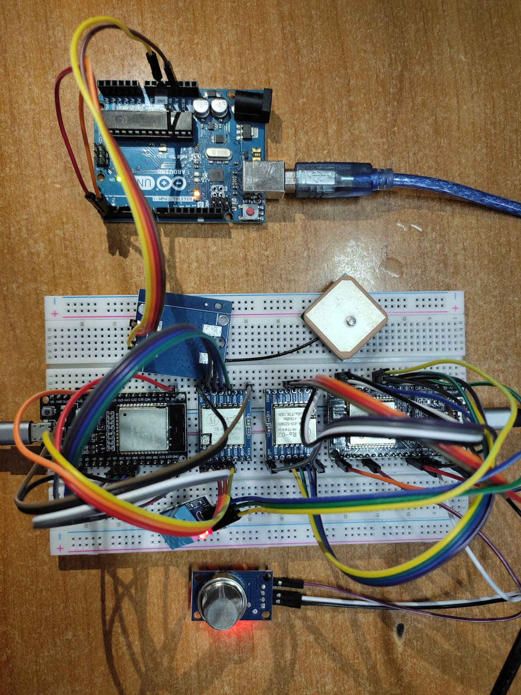

# Iot-Cold-Chain-Supply

This project is based on remote risk monitoring of Cold supply chain Storage. We need to monitor temperature, humidity and other gas compositions based on which we need to create a alert system to inform the user about any abnormality.

## Prototype Implementation 
### 1. Hardware
This is the prototype implementation we have created for our website with the help of ESP32 and other sensors

### 2. Software 
This is the admin panel dashboard (frontend) for displaying data and track live cold storage with the help of GPS

